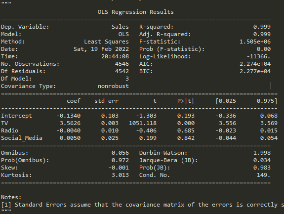

## 문제 01 유형

1. 결측값의 개수는 몇개 인가?

   ```python
   # 방법1
   data01.isna() #전체 df에서 결측치인 값은 TRUE
   data01.isna().sum() # 각 column별 결측치 개수를 series형태로 반환
   data01.isna().sum().sum() # 총 결측치의 개수
   
   # 방법2
   data01.isna().any(axis=1)	# 전체 행에서 결측치가 있는 행은 TRUE
   data01.isna().any(axis=1).sum() # TRUE(1)값의 총합
   ```

2. 각 변수들 간의 상관관계 분석

   ```python
   # TV, Radio, Social Media과 매출액 Sales와의 상관관계
   
   # 상관관계 분석 함수
   data01.corr()
   
   # 문제에서 필요없는 행과 제거 후 '매출액(Sales)' 컬럼 선택
   data01.corr().drop('Sales')['Sales']
   
   # 모든 값들을 절대값을 취하고 그중 가장 큰 값 선택
   data01.corr().drop('Sales')['Sales'].abs().max()
   
   # 문제에서 요구하는 소수점 5번째 자리에서 반올림
   round(data01.corr().drop('Sales')['Sales'].abs().max(), 4)
   
   # 추가 함수
   data01.corr().drop('Sales')['Sales'].abs().idxmax()				# max값의 index행의 값
   data01.corr().drop('Sales')['Sales'].abs().nlargest(2).index	# 상위 2개의 값
   data01.corr().drop('Sales')['Sales'].abs().argmax()				# max값의 위치
   
   # 조건으로 값 추출
   cor_dat = data01.corr().drop('Sales')['Sales'].abs()
   cor_dat > 0.6	# 0.6이 넘는 값들에 대해 boolean형태로 출력
   cor_dat.index[cor_dat > 0.6]	# 조건이 TRUE인 값의 index행의 값 출력 ['TV', 'Radio']
   ```

3. 회귀분석 수행

   ```python
   # 독립변수 : TV, Radio, Social Media
   # 종속변수 : 매출액
   # 회귀분석을 수행하였을때 3개의 독립변수 중 회귀계수가 큰 것에서 작은 것 순으로 기술
   # 결측치가 포함된 행은 제거하고, 회귀계수는 넷째 자리 이하는 버리고 기술
   
   # 결측치 행 제거
   q2 = data01.dropna()
   
   # ols함수로 회귀분석
   # ols함수 ols('종속변수~' + '+'.join(독립변수들), data=df_name).fit()
   from statemodels.formula.api import ols
   
   var_list = ['TV', 'Radio', 'Social Media']
   form1 = 'Sales~' + '+'.join(var_list)
   lr = ols(form1, data=q2).fit()
   lr.summary()
   
   # 회귀계수 추출
   coef_value = lr.params.drop('Intercept')	# lr에 params.drop('') 를통해 불필요한 행 제거
   coef_value.sort_values()	# sort_values(by='column_name') 설정 컬럼기준으로 오름차순
   coef_value.sort_values(ascending=False)		# ascending=False 내림차순 정렬
   coef_value.sort_values(ascending=False).index	# index행 이름 출력
   coef_value.sort_values(ascending=False).values	# 해당 정렬하는 컬럼 값 출력
   ```

   **ols().fit().summary()**

   

   - `Dep. Variable` : 종속변수
   - `Model` : 회귀분석 모델(OLS)
   - `Df Residuals` : 자유도(전체 표본 수 4546 - 독립변수 3개 - 종속변수 1개 = **4542**)
   - `Df Model` : 독립변수의 개수
   - `R squared` : 결정계수
   - `F-statistics` : F 통계량 = MSR/MSE
   - `Prob` : F통계량에 해당하는 P-value
   - `Intercept coef` : 회귀식의 절편 값(상수)
   - `독립변수 coef` : 각 독립변수의 회귀계수, 회귀식에서 기울기
   - 회귀식 : `y = 3.5626X1 - 0.0040X2 + 0.0050X3 - 0.1340`
   - `P > |t|` : p-value값

   **ols().fit().pvalues**

   - 독립변수들의 pvalues값
   - `lm2.pvalues.index[lm2.pvalues < 0.05]` : pvalues의 index행 값들중 0.05 미만인 index출력


## 문제 02 유형

- **EDA(Exploratory Data Analysis with Python)**
  - 탐색적 데이터 분석

1. 성별이 여성, 혈압이 High, Cholesterol이 Normal인 환자의 전체에 대한 비율

   ```python
   data02['Sex']	# Sex열 출력 series type
   data02['Sex', 'BP']		# Error
   data02[['Sex', 'BP']]	# Sex, BP열 출력 dataframe type
   
   # 'Sex', 'BP', 'Cholesterol' 컬럼만 추출
   q1 = data02[['Sex', 'BP', 'Cholesterol']]
   
   q1_len = len(q1[(q1['Sex']=='F') & (q1['BP']=='HIGH') & (q1['Cholesterol']=='NORMAL')])
   
   # 전체 환자 수에서 조건에 해당하는 환자수의 비율 계산
   q1_len / len(data02)
   
   # 강사님 방법
   # value_counts() 동일한 요소들이 몇개나 있는지 출력 (normalize=True)면 비율로 계산
   q1 = data02[['Sex', 'BP', 'Cholesterol']].value_counts(normalize=1)
   q1[('F', 'HIGH', 'NORMAL')]		# 해당요소를 만족하는 비율계산
   ```

2. `['Age', 'Sex', 'BP', 'Cholesterol', 'Na_to_k']` 값들이 `Drug` 타입에 영향을 미치는지 확인

   ```python
   # 1. 'Age_gr' : 20미만, 20 ~ 30, 30 ~ 40, 40 ~ 50, 50 ~ 60, 60이상 으로 변환
   # 2. 'Na_K_gr' : 10이하, 20이하, 30이하, 30초과
   # 3. var_list와 Drug변수와 영향이 있는지 독립성 검정
   
   # 컬럼생성
   where(condition, x, y) # condition에 해당하는 값이 참이면 x, 거짓이면 y
   q2['Age_gr'] = np.where(q2.Age < 20, 10,
                          np.where(q2.Age < 30, 20,
                                  np.where(q2.Age < 40, 30,
                                          np.where(q2.Age < 50, 40,
                                                  np.where(q2.Age < 60, 50, 60)))))
   q2['Na_K_gr'] = np.where(q2.Na_to_k <= 10, 'Lv1',
                           np.where(q2.Na_to_k <= 20, 'Lv2',
                                   np.where(q2.Na_to_k <=30, 'Lv3', 'Lv4')))
   
   # 독립성 검정
   # ['Sex', 'BP', 'Cholesterol', 'Age_gr', 'Na_K_gr'](범주형변수)들이 'Drug'변수에 영향이 있는지
   # 카이제곱 검정
   	# 범주형인 자료를 분석하는데 활용
       # 1. 적합도 검정
       # 2. 독립성 검정
       # 2개의 범주형 변수를 요약하는 2차원 분할표(pandas) => pd.crosstab(index=q2.Sex, columns=q2.Drug)
       # 분할표의 각 셀 별 빈도와 기대빈도의 차이의 크기로 검정 => chi2_contingency(분할표)
       	# 차이가 작으면 두 변수는 독립
       	# 차이가 크면 두 변수는 독립이 아님
       # from scipy.stats import chi2_contingency
   tab = pd.crosstab(index=q2.Sex, columns=q2.Drug)
   q2_out = chi2_contingency(tab)
   # 1. 카이스퀘어 통계량
   # 2. p-value	0.05보다 크면 귀무가설 채택 -> 독립이다.(관계가 없다)
   # 3. 자유도(r-1)(c-1)
   # 4. 기대빈도
     
   # 각 범주형 변수들(var_list)과 'Drug'와 1대1로 비교해야하니까 for문을 통해 반복해준다.
   var_list = ['Sex', 'BP', 'Cholesterol', 'Age_gr','Na_K_gr']
   q2_out = []
   
   for i in var_list:
       tab = pd.crosstab(index=q2[i], columns=q2.Drug)
       kai = chi2_contingency(tab)
       q2_out.append([i, kai[1]])	# [변수명, pvalue] 추가
   
   # df로 변환
   q2_out = pd.DataFrame(q2_out, columns=['var', 'pvalue'])
   q2_out[q2_out.pvalue < 0.05]	# q2_out에서 'pvalue' 컬럼중 0.05 미만인 값들의 df
   q2_out[q2_out.pvalue < 0.05].pvalue.max()   # 그중에 pvalue에서 가장 큰 값    
   q2_out[q2_out.pvalue < 0.05].pvalue.count()	# 조건을 만족하는 pvalue 개수
   ```

3. `['Sex', 'BP', 'Cholesterol']` 등 세 개의 변수를 다음과 같이 변환하고 의사결정나무를 이용한 분석

   ```python
   # Sex는 M을 0, F를 1로 변환하여 Sex_cd 변수 생성(범주형)
   # Bp LOW - 0, NORMAL - 1, HIGH - 2, BP_cd(순서형)
   # Ch NORMAL - 0, HIGH - 1, Ch_cd 생성
   
   q3=data02.copy()
   
   q3['Sex_cd']=np.where(q3.Sex == 'M', 0, 1)      # 결측치 처리에 대한 조건도 확인
   q3['BP_cd']=np.where(q3.BP == 'LOW', 0,
                   np.where(q3.BP == 'NORMAL', 1, 2))
   q3['Ch_cd']=np.where(q3.Cholesterol == 'NORMAL', 0, 1)
   
   # DecisionTree
   var_list = ['Age', 'Na_to_K', 'Sex_cd', 'BP_cd', 'Ch_cd']
   
   from sklearn.tree import DecisionTreeClassifier, export_tree
   
   dt = DecisionTreeClassifier().fit(q3[var_list], q3.Drug)	# fit으로 피처변수들, 라벨
   
   # 트리출력
   print(export_text(dt, feature_names=var_list, decimals=3))
   ```
   
   

## 문제 03 유형

1. 이마의 폭(forehead_width_cm)과 높이(forehead_height_cm) 사이의 비율(forehead_ratio)에 대해서 평균으로부터 3 표준편차 밖의 경우를 이상치로 정의할 때, 이상치에 해당하는 데이터는 몇 개 인가?

   ```python
   # raw data
   q1 = data03.copy()
   
   # 'forehead_ratio' 컬럼 정의
   q1['forehead_ratio'] = q1['forehead_width_cm'] / q1['forehead_height_cm']
   
   # q1['forehead_ratio']의 mean(), std()
   avg = q1['forehead_ratio'].mean()
   std = q1['forehead_ratio'].std()
   
   # 범위값 설정
   UP = avg + (std * 3)
   DOWN = avg - (std * 3)
   
   # 이상치 개수
   len(q1[q1['forehead_ratio'] > UP])
   len(q1[q1['forehead_ratio'] < DOWN])
   ```

2. 성별에 따라 forehead_ratio **평균에 차이**가 있는지 적절한 통계 검정을 수행

   ```python
   # 평균에 차이가 있는지 통계 검정을 수행하시오.
   # 검정은 이분산을 가정하고 수행한다.(이분산!! 분산이 같지 않다 -> equal_var=False)
   # -> 독립 이표본 t-검정
   # 		목적 : 두 모집단의 모평균의 비교에 관한 검정!!!!
   # 		가정 : 두 모집단은 모두 정규모집단 
   #			  각 모집단에서 추출된 표본은 서로 독립
   #			  두 모집단의 모분산은 알려져 있지 않았으나, 동일함.
   from scipy.stats import ttest_ind, ttest_rel
   q2 = data03.copy()
   q2.columns
   q2.gender.unique()
   
   g_m = q1[q1.gender == 'Male']['forehead_ratio']
   g_f = q1[q1.gender == 'Female']['forehead_ratio']
   
   # ttest_ind(모집단1, 모집단2, 등분산/이분산)
   q2_out = ttest_ind(g_m, g_f, equal_var=False)	# 이분산
   q2_out = # 검정통계량, pvalue
   
   # 신뢰수준 99% 0.01, 귀무가설의 기각( < 0.01)경우 Y
   round(q2_out.statistic, 3)
   q2_out.pvalue < 0.01 # -> True면 기각
   ```

   

