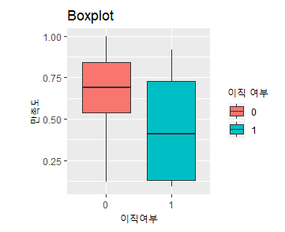
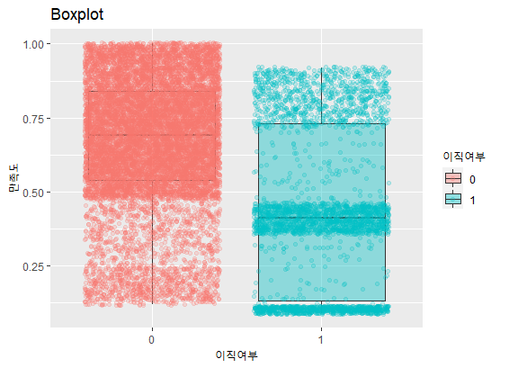
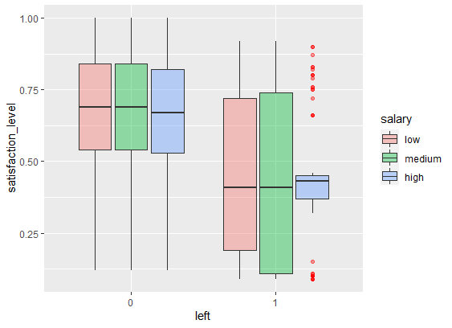
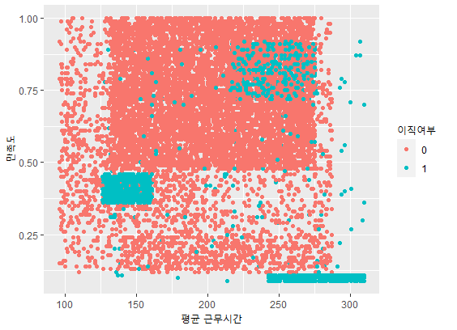
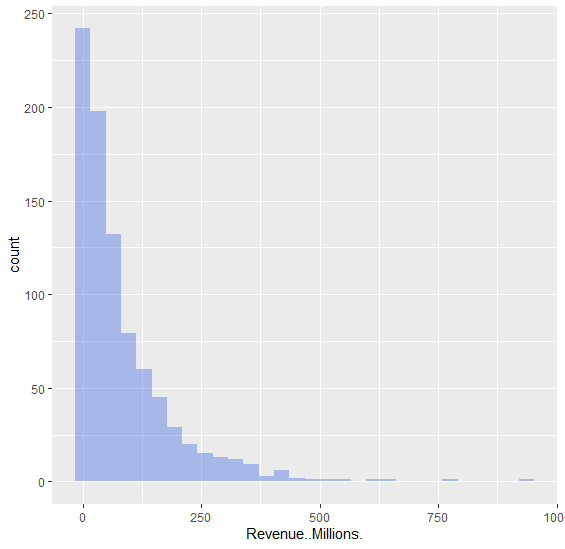
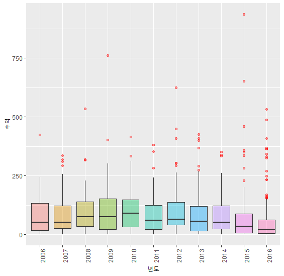

# R_programming

## Ch3.

### 예제 실습1

- Work_accident, left, promotion_last_5years는 명목형 변수라 Factor형태여야 하는데 int형이라서 형 변환을 해주어야 한다.

  ```R
  HR$Work_accident = as.factor(HR$Work_accident)
  HR$left = as.factor(HR$left)
  HR$promotion_last_5years = as.factor(HR$promotion_last_5years)
  ```

  **이렇게 분석하고자 하는 변수가 명목형, 순서형, 연속형인지 제대로 파악을 해야하는 작업은 중요하다.**

- `haed(HR, n=3)` : HR 데이터에서 상위 3개의 row데이터 출력


#### 조건에 맞는 데이터 가공하기

- 새로운 컬럼 생성

  `HR$column_name`

- 조건 함수(`ifelse()`)

  `ifelse(HR$satisfaction_level > 0.5, 'High', 'Low')` : (조건문, 조건문True, 조건문False)

  ```R
  # dplyr 패키지 활용
  # ifelse안에 ifelse
  HR$satisfaction_level_group_2 = ifelse(HR$satisfaction_level > 0.8, 'High', 
                                     ifelse(HR$satisfaction_level > 0.5, 'Mid', 'Low'))
  # 범주형 데이터로 변경
  HR$satisfaction_level_group_2 = as.factor(HR$satisfaction_level_group_2)
  ```

- `subset()` 함수

  ```R
  # 새로운 데이터 셋 = subset(추출할 데이터 셋, 조건)
  HR_High = subset(HR, salary == 'high')
  
  # 두가지 조건을 만족하는 데이터셋 생성
  HR_High_TT = subset(HR, salary == 'high' & sales == 'IT')
  
  HR_High_IT2 = subset(HR,salary == 'high' | sales == 'IT')
  
  # 결과 확인
  print(xtabs(~ HR_High_IT2$sales + HR_High_IT2$salary))
  ```


#### 조건에 맞는 집계 데이터 만들기

- **ddply를 활용한 집계 데이터 만들기**

  ```R
  SS=ddply(HR, # 분석할 Data Set 설정
           c("sales","salary"),summarise, # 집계 기준 변수 설정
           M_SF = mean(satisfaction_level), # 컬럼명 및 계산 함수 설정
           COUNT =length(sales), 
           M_WH = round(mean(average_montly_hours),2))
  ```


#### ggplot2 기본 시각화

- `ggplot(HR)` : 기본 회색 배경 생성
- `ggplot(HR, aes(x = salary))` : aes로 축설정을 해주면 x축에 salary의 정보가 생성된다.
- **막대 도표**
  - `ggplot(HR, aes(x = salary)) + geom_bar()` : ggplot뒤에 원하는 그래프를 지정해준다.
  - `ggplot(HR, aes(x = salary)) + geom_bar(aes(fill = salary))` : geom_bar안에 aes안에 salary를 설정해주면 시각화 대상 데이터 안에 포함되어 있어서 다른 결과가 나온다.
- **히스토그램**
  - `ggplot(HR, aes(x=satisfaction_level)) + geom_histogram()`
  - `ggplot(HR, aes(x=satisfaction_level)) + geom_histogram(binwidth=0.01, col='red', fill='royalblue')`

- **밀도그래프**

  - `ggplot(HR, aes(x=satisfaction_level)) + geom_density()`
  - `ggplot(HR, aes(x=satisfaction_level)) + geom_density(col='red', fill='royalblue')`

- **박스플롯**

  - `ggplot(HR, aes(x=left, y=satisfaction_level)) + geom_boxplot(aes(fill=left)) + xlab("이직여부") + ylab("만족도") + ggtitle("Boxplot") + labs(fill = "이직 여부")`
    
  - `ggplot(HR, aes(x=left, y=satisfaction_level)) + geom_boxplot(aes(fill=left), alpha = I(0.4)) + geom_jitter(aes(col = left), alpha = I(0.1)) + xlab("이직여부") + ylab("만족도") + ggtitle("Boxplot") + labs(fill = "이직여부", col = "이직여부")`
    alpha = I(0.3) : 투명도
    

  - `ggplot(HR, aes(x=left, y=satisfaction_level)) + geom_boxplot(aes(fill = salary), alpha = I(0.4), outlier.color = 'red')`
    

- **산점도(Scatter Plot)**

  두 연속형 변수의 상관관계를 표현해주는 2차원 그래프

  모델링 전에 변수들 간의 관계를 파악하는데 있어, 가장 효과적이다.

  - `ggplot(HR, aes(x=average_montly_hours, y=satisfaction_level)) + geom_point(aes(col=left)) + labs(col='이직여부') + xlab("평균 근무시간") + ylab("만족도")`
    

- **연습문제**

  1. HR 데이터의 행의 수, 열의 수를 구하시오.

     `dim(HR)`

  2. salary변수의 string에 대해 답하시오.

     `str(HR$salary)`

  3. salary변수에 대하여 low는 1, medium은 2, high는 3의 값을 가져 서열정보를 가지게 하는 salary_New 변수를 만드시오.

     ```R
     HR$salary_New = ifelse(HR$salary == 'high', 3, ifelse(HR$salary == 'medium', 2, 1))
     ```

  4. Salary_New 값이 2이면서 left는 1인 직원들만 뽑아 Medium_Left라는 새로운 데이터프레임을 만드시오.

     ```R
     Medium_Left = subset(HR, salary_New == 2 & left == 1)
     ```

     

## Ch5.

- 데이터 불러오기

  `IMDB = read.csv("C:/coding/Python/R_Programming/예제 데이터/IMDB-Movie-Data.csv")`

#### 결측치 처리

```R
# 결측치 확인
is.na(IMDB$Metascore)	# True값이면 결측치 값
sum(is.na(IMDB$Metascore))	# 총 결측치 개수
colSums(is.na(IMDB))	# 변수(col)별 결측치 개수

# 결측치 삭제
IMDB2 = na.omit(IMDB)	# IMDB2라는 새로운 데이터 셋을 만들어 결측치를 제거한 값 대입

# 12번째 열에 결측치가 있는 경우에만 삭제
IMDB3 = IMDB[complete.cases(IMDB[ ,12]),]

# 결측치를 특정값으로 대체
IMDB$Metascore2 = IMDB$Metascore
IMDB$Metascore2[is.na(IMDB$Metascore2)] = 58.99

# 결측치를 포함하고 평균계산
mean(IMDB$Revenue..Millions.)	# NA값 출력

# 결측치를 제외하고 평균계산
mean(IMDB$Revenue..Millions., na.rm = TRUE) # na.rm = TRUE
```

- **complete.case()**

  complete cases함수는 행에 누락된 데이터가 없는(NA가 존재하지 않는)지를 확인해주는 함수로서 해당 행 전체에 누락된 데이터가 없다면 TRUE를 반환하고, 누락된 데이터가 존재하면 FALSE를 반환한다.


#### 결측치 처리를 위한 데이터 분포 탐색

- histogram, boxplot

  ```R
  # histogram
  ggplot(IMDB, aes(x=Revenue..Millions.)) + geom_histogram(fill='royalblue', alpha=0.4)
  
  # boxplot
  ggplot(IMDB, aes(x='', y=Revenue..Millions.)) + geom_boxplot(fill='green', alpha=0.4, outlier.color = 'red')
  ```

  

  그래프의 분포를 보면 데이터가 한쪽으로 치우쳐져 있다. 이런 분포는 항상 평균(mean)과 중위수(median)을 봐야 한다.

  이런 분포의 데이터의 결측치는 평균으로 대체하면 Outlier의 영향을 받아 위험하다.

  해결책은 평균보다는 Outlier의 영향을 받지 않는 중위수로 대체하는 것이 그나마 낫다.


#### 이상치 뽑아내기

- boxplot를 통해 이상치 탐색

  ```R
  # ggplot에서 IMDB데이터 셋에서 aes를 통해 x, y값 설정
  ggplot(IMDB,aes(x=as.factor(Year),y=Revenue..Millions.))+
    # boxplot에 Year변수를 factor형태로 변환하여 fill해준다.
    geom_boxplot(aes(fill=as.factor(Year)), outlier.colour = 'red',alpha=I(0.4))+
    xlab("년도") + ylab("수익") + guides(fill = FALSE) +
    theme_bw() +	# 표 배경 회색 없애기
    theme(axis.text.x = element_text(angle = 90))	# x축 텍스트 각도 변경
  ```

  

  - 상자 안에 그려진 직선은 **중위수(Median)**
  - 상자 안에 그려진 밑변은 **1분위수**, 윗변은 **3분위수**
  - 상자 중심으로 위아래로 뻗어 있는 선은 **울타리**
    - 아래 울타리 계산식 : Q1 - 1.5 * (Q3 - Q1)
    - 위 울타리 계산식 : Q3 + 1.5 * (Q3 - Q1)
    - <u>이 울타리를 벗어난 값들을 Outlier라고 한다.</u>

- **Outlier의 처리**

  1분위수와, 3분위수를 계산하고 각각 울타리 값을 계산한 후 그 범위에 벗어나는 값들을 제거해준다.

  ```R
  # Outlier인 데이터 제거하기
  
  # 1분위수 계산
  Q1 = quantile(IMDB$Revenue..Millions.,probs = c(0.25),na.rm = TRUE) 
  # 3분위수 계산
  Q3 = quantile(IMDB$Revenue..Millions.,probs = c(0.75),na.rm = TRUE)
  
  LC = Q1 - 1.5 * (Q3 - Q1) # 아래 울타리
  UC = Q3 + 1.5 * (Q3 - Q1) # 위 울타리
  
  IMDB2 = subset(IMDB,
       Revenue..Millions. >  LC & Revenue..Millions. < UC)
  ```

  기존에 결측치를 제거했던 `IMDB2` 데이터 셋에 Outlier 값을 제거


#### 문자열 데이터 다루기

- 문자열 대체 : gsub()
- 문자열 분리 : strsplit()
- 문자열 합치기 : paste()
- 문자열 추출 : substr()
- 텍스트마이닝 함수 : Corpus() & tm_map(), & tdm()

```R
# 첫번째 obs(row)의 Actors변수(col)에서 1 ~ 5번째 해당하는 문자열 추출
substr(IMDB$Actors[1], 1, 5)

# 문자열 붙이기
paste(IMDB$Actors[1],"_",'A')

# 띄어쓰기 없이 붙이기
paste(IMDB$Actors[1],"_",'A', sep="")

# |로 붙이기
paste(IMDB$Actors[1],"_",'A', sep="|")
# paste()함수는 기본적으로 띄어쓰기가(' ')가 옵션으로 설정되어있다. sep옵션으로 제거 해주어야한다.

# 문자열 분리
strsplit(as.character(IMDB$Actors[1]), split=',')	# 문자열을 콤마로 분리

# 문자열 대체
IMDB$Genre2 = gsub(",", " ", IMDB$Genre)
```


#### 텍스트 마이닝

- 텍스트 마이닝 절차

  1. 코퍼스(말뭉치) 생성
  2. TDM(문서 행렬) 생성
  3. 문자 처리(특수문자 제거, 조사 제거, 숫자 제거 등..)
  4. 문자열 변수 생성

- 1단계 : 코퍼스 생성

  ```R
  library(tm) # tm 패키지 설치 필요
  
  CORPUS = Corpus(VectorSource(IMDB$Genre2)) # 코퍼스 생성
  CORPUS_TM = tm_map(CORPUS,removePunctuation) # 특수문자 제거
  CORPUS_TM = tm_map(CORPUS_TM, removeNumbers) # 숫자 제거 
  CORPUS_TM = tm_map(CORPUS_TM, tolower) # 알파벳 모두 소문자로 바꾸기
  ```

- 2단계 : 문서행렬 생성

  - 특정 단어를 변수로 만들어, 분석에 사용하려는 목적

  ```R
  # 문서행렬 생성
  TDM = DocumentTremMatrix(CORPUS_TM)
  
  # 문서 행렬을 데이터프레임 형태로 만들어주기
  TDM = as.data.frame(as.matrix(TDM))
  ```

- 3단계 : 기존데이터와 결합하기

  ```R
  IMDB_GENRE = cbind(IMDB, TDM)
  ```

  - 합쳐야 할 두 데이터가 같은 행을 가지고 순서도 같다면, `cbind` 옆으로 합치기

  - 합쳐야 할 두 데이터가 같은 열을 가지고 순서도 같다면, `rbind` 아래로 합치기

  - `merge` : 행과 열이 다른 두 데이터 셋을 하나의 기준으로 합칠 때

#### 연습문제

1. IMDB 데이터 셋의 Revenue Millions 변수에 존재하는 결측치를 모두 0으로 전환시켜 Revenue_NonNA라는 변수를 만드시오.

   ```R
   IMDB$Revenue_NonNA = IMDB$Revenue..Millions.
   IMDB$Revenue_NonNA[is.na(IMDB$Revenue_NonNA)] = 0
   IMDB$Revenue_NonNA
   ```

2. Revenue Millions의 이상치범위를 계산해보세요

   ```
   # 1분위수 계산
   Q1 = quantile(IMDB$Revenue..Millions.,probs = c(0.25),na.rm = TRUE) 
   # 3분위수 계산
   Q3 = quantile(IMDB$Revenue..Millions.,probs = c(0.75),na.rm = TRUE)
   
   LC = Q1 - 1.5 * (Q3 - Q1) # 아래 울타리
   UC = Q3 + 1.5 * (Q3 - Q1) # 위 울타리
   ```
   
   

## Ch6.

#### 패키지 설치

```R
install.packages("dplyr")
install.packages("reshape")
install.packages("plyr")
```

#### apply 함수

- HR 데이터 셋의 1, 2열 평균을 구하고자 한다.

```R
# for문
for (i in 1:2){
	print(paste(colnames(HR)[i], ":", mean(HR[,i])))
}

# apply문
apply(HR[,1:2],2,mean)

# colMeans
colMeans(HR[, 1:2])

# 결측치를 제외하는 표준편차 구하는 함수
colSd = function(x){

  y = sd(x,na.rm = TRUE)

  return(y)

}

# 적용
apply(HR[,1:2],2,colSd)
```

apply(데이터, 계산 기준(1 or 2), 함수) - 1(row), 2(col)

기존에 없는 함수들을 구현하여 사용할 때 apply에 사용자 함수를 적용해준다.

결측치가 존재할 경우 함수에서 `na.rm = TRUE` 옵션을 추가로 넣어준다.

- **apply계열 함수 소개**

  - 그룹간 평균을 구하고 싶을 때

    ```R
    # tapply함수 사용 - (데이터, 그룹, 연산함수)
    # 그룹의 종류가 5가지면 같은 종류의 데이터끼리의 연산함수를 수행한다.
    tapply(HR$satisfaction_level,HR$left,mean)
    
    # 중복 제거 col
    HR %>% distinct(time_spend_company, .keep_all = TRUE)
    ```

    

- **dplyr패키지 소개**

  ```
  ```


#### 연습문제

3. reshape 패키지 함수를 활용하여 다음의 데이터 셋을 만들어보시오.

   ```
   ```

   

## Ch7.

### 집계 데이터 만들기

```R
Group_Data = STOCK %>%
  # group_by함수로 집계 기준 변수를 정해줌.
  group_by(Year,Day) %>%
  # summarise함수로 집계 기준 변수 및 명령어에 따라 요약 값을 계산
  summarise(Mean = round(mean(Open)),
            Median = round(median(Open)),
            Max = round(max(Open)),
            Counts = length(Open))
```

- **조건에 따라 데이터 추출하기**

  ```R
  # filter()
  Subseted_Data = Group_Data %>%
   filter(Year == "2012")
  ```

- **데이터 중복 제거하기**

  ```R
  Duplicated_Data2 = Duplicated_Data %>%
   distinct(Year,Day,Mean,Median,Max,Counts)
  ```

- **샘플 데이터 무작위 추출**

  - `sample_frac()`

    ```R
    # sample_frac() - 그룹이 지정되어 있는 데이터
     Sample_Frac_Gr = Group_Data %>%
    	sample_frac(size = 0.4, replace = FALSE)
    # 각 년도에서 2개씩 균형있게 sampling된 데이터 추출
    
    # 그룹이 해제되어 있는 데이터는 무작위로 데이터가 추출된다.
    ```

  - `sample_n()`

    ```R
    # 그룹된 데이터 같은 경우는 그룹당 년도가 5개 밖에없어서 size의 최댓값이 5여야 한다.
    Sample_N_Gr = Group_Data %>%
     sample_n(size = 5, replace = FALSE)
     
    # 그룹되지 않은 데이터는 무작위로 뽑혀 입력한 size수 만큼 출력된다.
    Sample_N_Un = Ungroup_Data %>%
      sample_n(size = 10, replace = FALSE)
    ```


### 여러가지 함수

- **slice()** - 원하는 구간만 추출

- **top_n()** - 설정한 변수를 기준으로 가장 값이 높은 n개의 데이터 출력

- **arrange()** - 설정한 변수를 기준으로 오름차순 정렬 '-'는 내림차순

- **select()** - 설정한 변수만 뽑아서 출력 (index로 입력해도되고, 변수를 입력해도되고)

- **select_if()** - 설정한 조건에 만족하는 변수들 출력

- **mutate()** - 하나의 변수를 추가해주는 함수

  ```R
  Mutate_Data = STOCK %>%
   mutate(Divided = round(High/Low,2)) %>%
   select(Date,High,Low,Divided)
  ```

- **mutate_if()**

  ```R
  # integer 타입 변수를 모두 numeric으로 변경
  
  Mutate_If_Data = STOCK %>%
   mutate_if(is.integer,as.numeric) 
  ```

- **mutate_at()**

  ```R
  # -로 제외한 변수들은 제외하고 입력한 계산식을 실행
  Mutate_At_Data = STOCK %>%
   mutate_at(vars(-Date,-Year,-Day),log) %>%
   select_if(is.numeric)
   # Date, Year, Day를 제외하고 나머지 변수들은 log변환
  ```

  

## 2021년 버스노선별 정류장별 시간대별 승하차 인원 정보(12월)

