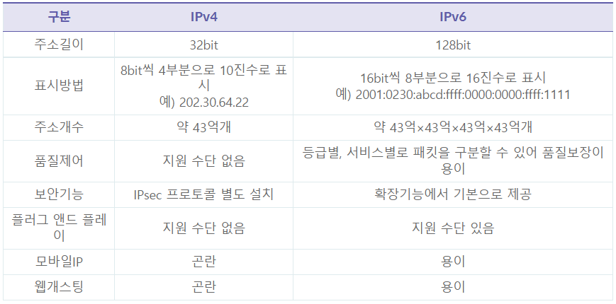

# 네트워크 정리

출처 : https://mindnet.tistory.com/entry/%EB%84%A4%ED%8A%B8%EC%9B%8C%ED%81%AC-%EC%9D%B4%ED%95%B4%ED%95%98%EA%B8%B0-1%ED%8E%B8-Bit-%EC%99%80-Byte-%EC%B0%A8%EC%9D%B4%EC%A0%90?category=702276

### Bit와 Byte 차이점

- 컴퓨터는 두 가지 상태(2진수의 0과 1)형태만 이해하고 사용할 수 있다.
- 컴퓨터는 일반적으로 8개의 단위의 비트(8bit)를 하나의 그룹으로 사용하는데 이를 **바이트(Byte)**라고 한다.
  - 즉, 1바이트는 8개의 on/off 상태조합을 나타내서 0 ~ 255까지 총 256개의 숫자 값을 가질 수 있다.
- 인터넷 속도 1000Mbps는 bps가(bit per second) 초당 전송되는 비트를 의미하기 때문에, 1비트는 1/8바이트여서 100Mbit에 0.125Mbit를 나눠 12.5MByte라는 전송속도가 나온다.

### 네트워크랑? 네트워크 장점과 단점, 종류

- 컴퓨터들이 통신 기술을 이용하여 그물망 처럼 연결된 통신 이용 형태
  - 두 대 이상의 컴퓨터 들을 연결하고, 서로 통신할 수 있는 것!
- 장점
  - 파일공유
  - 미디어 스트리밍
  - 광대역 인터넷 연결
  - 프린터 공유
  - 네트워크 게임
  - 무선 네트워크
- 단점
  - 공유를 통해 바이러스나 악성코드가 침투 할 수 있고, 해킹으로 개인 정보 유출이나 데이터 변조가 생길 수 있다.
- 네트워크의 규모
  - PAN(Personal Area Network)
  - LAN(Local Area Network)
  - MAN(Metropolitan Area Network)
  - WAN(Wide Area Network)

### LAN 이란? LAN의 토폴로지

- LAN은 Local Area Network 근거리 통신망
- 다수의 독립된 컴퓨터 기기들이 상호간에 통신이 가능 하도록 하는 데이터 통신 시스템
- **토폴로지**(Topology)
  - 네트워크를 구성하는 노드와 노드간에 연결 상태에 대한 배치를 의미하며 "통신망 구조"라고 이해
  - Bus(버스형) - CSMA/CD방식을 주로 사용
  - Ring(링형) - 버스형과 달리 거리 제약이 적다.
  - Star(스타형) - 중앙 제어 방식, 중앙제어 장비가 고장나면 모든 시스템에 영향을 미친다.
  - Mash(메쉬형) - 네트워크 상의 모든 노드들이 연결된 형태로써 하나의 노드가 고장나도 다른경로를 통해 통신이 가능, 다만 구조가 복잡함.

### 인터넷이란? International Network

- TCP/IP(Transmission Control Protocol / Internet Protocol)을 기반으로 전세계의 네트워크를 하나로 연결하여 각각 PC가 가지고 있는 자료나 정보를 주고 받을 수 있는 광역 네트워크를 인터넷이라고 한다.
- LAN과 LAN을 연결하는 WAN이 서로 다른 WAN들과 연결되어 하나의 네트워크를 구성한 네트워크를 칭한다.
- 다만, 인터넷 서비스를 이용하려면 직접 연결된 ISP(Internet Service Provider)가 제공하는 인터넷 서비스 가입이 필요하다.

### 프로토콜 이란? Protocol

- 한국어와 외국어와 같이 서로 이해할 수 없는 언어를 사용하면 대화할 수 없다.
- 마찬가지로 컴퓨터와 컴퓨터, 장비와 장비간에 서로 통신을 할때 이해 할 수 없는 언어를 사용하면 통신이 안된다.
- 컴퓨터와 컴퓨터가 서로 이해할 수 잇는 언어, 공용된 언어를 사용 해야 하는데 이 것이 바로 프로토콜이다.
- 프로토콜의 기능
  1. 세분화와 재합성
  2. 캡슐화
  3. 연결제어
  4. 오류제어
  5. 흐름제어
  6. 동기화
  7. 순서 결정
  8. 주소 설정
  9. 다중화
  10. 전송 서비스
- 특성에 따른 형태 분류
  1. 직접/간접 프로토콜
  2. 단일체/구조적 프로토콜
  3. 대칭/비대칭 프로토콜

- TCP/IP는 컴퓨터와 컴퓨터가 통신 회선 등으로 연결 하기 위한 통신 규약

### OSI 7Layer & TCP/IP Model Layer

- TCP/IP는 4개의 계층적 구조를 가지며 각 계층마다 독립적인 기능을 가지면서 다른 계층에 영향을 미치지 않는 구조

- 4개의 계층적 구조에는 **Application**, **Transport**, **Internet**, **Network Interface**가 있고, 4계층을 대표하며 이를 좀더 세분화하여 계층화 한 것이 OSI 7 Layer이다.

- OSI 7 Layer를 알아야 하는 이유

  - 데이터 흐름을 알 수 있다.

  - Trouble Shooting 문제를 해결하기 쉽다.

    케이블 확인 -> 스위치 -> 공유기 -> 모뎀 -> ISP확인

  - Standard 표준화

    동일한 protocol을 사용해야 통신이 가능

- **OSI 7 Layer**
  
  1. 물리계층(Physical Layer)
  
     - 2계층 까지 만들어진 프레임(데이터)를 컴퓨터가 이해할 수 있는 2진수로 변환하고 전기적인 신호로써 전송로를 통해 목적지까지 실질적인 데이터를 전달
  
  2. 데이터 링크계층(DataLink Layer)
  
     - 물리적 주소를 기반으로 노드 대 노드로 데이터 전송 형태를 결정
  
  3. 네트워크 계층(Network Layer)
  
     - **논리적 주소**(IP)를 기반으로 출발지에서 목적지까지 가는 **데이터 경로**를 결정
  
     1. IP(Internet Protocol) : 논리적 주소를 통해 최적 경로를 선택하여 데이터를 전송할 수 있게 한다.
     2. ICMP(Internet Control Message Protocol) : 패킷 전송시 발생한 메세지와 에러 정보를 알려준다.
     3. ARP(Address Resolution Protocol) : 논리적 주소(IP)를 통해 상대의 MAC Address를 찾는다.
     4. RARP(Reverse ARP) : ARP반대 개념으로 물리적 주소를 통해 논리적 주소를 알려준다.
  
  4. 전송 계층(Transport Layer)
  
     - 데이터 전송 방식을 결정하고, 서비스의 포트번호를 구별할 수 있다.
  
     1. TCP : Connection-Oriented 패킷 전송을 제어하며, 데이터 전송시 에러를 복구 할 수 있으며, 신뢰성을 가진다.
     2. UDP(User Datagram Protocol) : Connectionless 패킷 전송을 제어하며, 데이터 전송시 발생한 에러를 복구 할 수는 없으나 **오버헤드가 적어 속도가 빠른 편이다.**
  
  5. 세션 계층(Session Layer)
  
     - 응용프로그램 간에 또는 네트워크 간에 연결을 맺거나 끊거나 유지, 연결 상태를 담당 
  
  6. 표현 계층(Presentation Layer)
  
     - 7계층에서 만들어진 데이터를 컴퓨터가 인식 할 수 있도록 데이터 표현 방식을 알려준다.
  
  7. 응용 계층(Application Layer)
  
     - 데이터를 생성하는 목적으로 사용자에게 인터페이스와 네트워크 서비스를 제공

### 네트워크 모델이란? Server-Client, Peer-to-Peer방식

- 네트워크 모델이란 네트워크를 구축할 때 어떠한 구조로 구축할지 결정하는데, 어떤 구조를 가지고 구축해야 할지 보다 **어떤 서비스를 제공하는 네트워크인지**를 결정하는 고민을 더 해야 한다.
- 용도에 따라 Server-Client방식과 Peer-to-Peer방식으로 나눠져 구현 된다.
- 네트워크 모델은 네트워크에서 장비에서 장비로 자원 또는 데이터를 공유하는 방법을 나타낸다.

**Server-Client**

Server용 컴퓨터는 일반 컴퓨터보다 고성능을 가지고 유닉스, 리눅스등 다양한 OS를 가지며 동시 접속 사용자에게 서비스를 제공한다.

중앙 집중식 관리가 가능하고 백업이 용이하며, P2P보다 빠르고 체계적인 구조를가진다.

**Peer-to-Peer**

각 노드들이 동등한 입장에서 1대1 통신을 하고 서비스 제공자가 요청자가 되기도 한다.

중앙 집중식이 아니어서 Server에 의존할 필요가 없다.

그러나, 동시에 많은 사용자 접속시 부하가 많이 생길 수 있다.

### 물리적 계층(Physical)

- 장비 : Hub, Repeater, Transceiver

1. 버스형 네트워크 구성방식
2. 스타 방식 네트워크 시스템
3. 링 방식의 네트워크 구축
4. 완전 메시 토폴로지
5. 부분 메시 토폴로지

### IP란?

- IP자체는 비 연결지향적이며 신뢰할 수 없는 프로토콜임.

- 비신뢰성 : 가능한 범위 내에서 패킷을 목적지까지 전달

- 비접속형 : 연결 설정 없이 패킷을 전송(비연결지향)

- 주소지정 : 네트워크 내의 노드를 고유하게 지정하기 위해 IP 사용

- 경로설정 : 목적지 IP주소를 기반으로 패킷 전달 경로 판단.

  | 공인 IP 주소                            | 사설 IP 주소                        |
  | --------------------------------------- | ----------------------------------- |
  | 비용이 든다.                            | 비용이 들지 않는다.                 |
  | 인터넷이 된다.                          | 인터넷이 안된다.                    |
  | A, B, C클래스에서 사설 IP를 제외한 대역 | A, B, C클래스에 각각 한 대역씩 있음 |
  | 서비스를 제공받기 위함                  | 같은 네트워크에서 우리끼리 사용     |
  | IP주소가 유일해야 한다.                 | IP주소가 중복되어도 된다.           |

  NAT : 사설 IP가 인터넷에 연결하도록 제공해주는 서비스(PC 대수가 많아도 외부에서는 모른다.)

  공유기 : **NAT를 사용**하는 대표적인 장비

- 데이터 전송 타입

  - 유니캐스트 : 데이터 전달
  - 브로드캐스트 : 정보 수집용
  - 멀티캐스트 : 주로 방송용

### NTP란?(Network Time Protocol)

- NTP는 네트워크로 연결되어 있는 컴퓨터들 끼리 시간을 동기화 시키는데 사용되는 프로토콜이다.

### TCP 3Way-Handshake & 4Way-Handshake

- TCP 3-way Handshake : TCP/IP 프로토콜을 이용해서 통신을 하는 응용프로그램이 데이터를 전송하기 전에 **먼저 정확한 전송을 보장하기 위해 상대방 컴퓨터와 사전에 세션을 수립**하는 과정
  - Client -> Server : TCP SYN
  - Server -> Client : TCP SYN+ACK
  - Client -> Server : TCP ACK
- TCP 4-way Handshake : 3-way가 세션을 수립할 때 사용한다면, 4-way는 세션을 종료하기 위해 수행되는 절차이다.
  1. Client가 연결을 종료하겠다는 FIN플래그를 전송한다.
  2. Server는 일단 확인 메세지를 보내고 자신의 통신이 끝날때까지 기다리는데 이 상태가 **TIME_WAIT** 상태다.
  3. Server가 통신이 끝났으면 연결이 종료되었다고 Client에게 FIN 플래그를 전송한다.
  4. Client는 확인 했다는 메세지를 보낸다.

### IPv6 이란?

- IPv6주소는 IPv4주소 부족 문제 해결을 위하여 설계되었다.
- 기존 IPv4와의 가장 큰 차이점은 IP주소의 길이가 32bit에서 128bit로 확대되었다.

### 듀얼스택 이란?

- 하나의 시스템(호스트 또는 라우터)에서 IPv4와 IPv6 프로토콜을 모두 처리하는 기술

### IPv4 / IPv6 주소 변환 기술

- Network layer : SIIT(Stateless IP/ICMP Translation) - 헤더 변환방식
- Transport layer : TRT(Transport Relay Translator) - 전송 릴레이 방식
- Aplication layer : ALG(Application Level Gateway) - 응용 계층 게이트워이 방식 
- 터널링 : 터널링 기술은 트래픽이 IPv6 망에서 인접한 IPv4 망을 거쳐서 건너편 IPv6 망으로 통신할 때 IPv4 망에 터널을 만들어 IPv6 패킷을 통과시키는 개념
